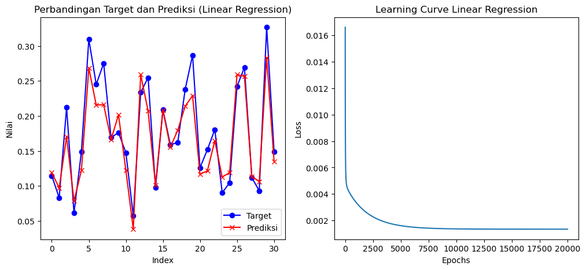
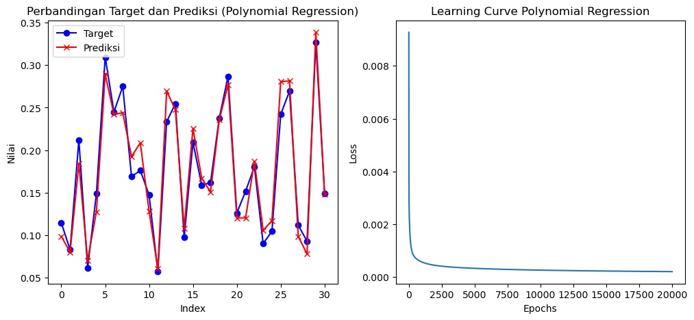

# Car Price Prediction: Linear and Polynomial Regression From-Scratch Using Gradient Descent

## **Deskripsi Proyek**
Proyek ini bertujuan untuk memprediksi harga mobil bekas berdasarkan fitur-fitur seperti tahun produksi, tipe bahan bakar, transmisi, dan jumlah kilometer yang telah ditempuh. Fokus utama proyek ini adalah membangun algoritma **from scratch** untuk memahami konsep fundamental machine learning.

Dalam proyek ini:
- **Loss function** dan **gradient descent** diimplementasikan secara manual menggunakan NumPy.
- **Polynomial features** dibentuk menggunakan `PolynomialFeatures` dari Scikit-learn untuk mempermudah pembentukan fitur non-linear.
- Model dievaluasi menggunakan metrik seperti **Mean Squared Error (MSE)**.

## **Fitur Utama**
- Implementasi manual untuk **gradient descent** dan fungsi biaya (loss function).
- Eksplorasi data awal dan preprocessing.
- Model linear regression dan polynomial regression.
- Visualisasi hubungan antara variabel fitur dan harga jual mobil.

## **Struktur Proyek**
```
├── notebook.ipynb         # Notebook utama
├── data/                  # Folder untuk menyimpan dataset
├── results/               # Hasil visualisasi dan evaluasi model
├── requirements.txt       # Daftar pustaka Python yang digunakan
└── README.md              # Dokumentasi proyek
```

## **Prasyarat**
- Python 3.8+
- Jupyter Notebook atau Jupyter Lab

## **Cara Menjalankan**

### 1. Clone Repository
Clone repository ini ke komputer lokal Anda:
```bash
git clone https://github.com/S4njuuu3291/multiple-linreg-scratch.git
cd multiple-linreg-scratch
```

### 2. Instalasi Dependensi
Buat virtual environment (opsional) dan instal pustaka yang diperlukan:
```bash
python -m venv env
source env/bin/activate  # Untuk Linux/MacOS
env\Scripts\activate    # Untuk Windows

pip install -r requirements.txt
```

### 3. Jalankan Notebook
Jalankan Jupyter Notebook untuk melihat proses analisis:
```bash
jupyter notebook notebook.ipynb
```

---

## **Dataset**
Dataset yang digunakan dalam proyek ini diambil dari [Kaggle Vehicle Dataset from Cardekho](https://www.kaggle.com/datasets/nehalbirla/vehicle-dataset-from-cardekho). Dataset ini berisi informasi tentang kendaraan, termasuk spesifikasi dan harga jual kembali.

### **Informasi Dataset**
- **Ukuran Dataset**: 301 baris × 8 kolom.
- **Format File**: CSV
- **Fitur Utama**:
  1. **Car_Name**: Nama kendaraan.
  2. **Year**: Tahun pembuatan kendaraan.
  3. **Selling_Price**: Harga jual kembali kendaraan (dalam Lakhs).
  4. **Present_Price**: Harga awal kendaraan (dalam Lakhs).
  5. **Kms_Driven**: Jumlah kilometer yang sudah ditempuh kendaraan.
  6. **Fuel_Type**: Jenis bahan bakar kendaraan (Diesel/Petrol/Other).
  7. **Seller_Type**: Jenis penjual (Dealer/Individual).
  8. **Transmission**: Jenis transmisi kendaraan (Manual/Automatic).

## **Hasil yang Dicapai**

### **Visualisasi**
- Scatter plot hubungan tahun mobil dan harga jual.
- Scatter plot hubungan jarak tempuh mobil dan harga jual.
- Perbandingan prediksi model dengan data aktual.

### **Evaluasi Model**
- **Linear Regression**: Model linear menghasilkan prediksi dasar dengan tingkat error tertentu, dievaluasi menggunakan MSE.
- **Polynomial Regression**: Model polynomial memberikan prediksi lebih akurat dengan memperhitungkan hubungan non-linear antara fitur dan target.

**Visualisasi Hasil:**
- Linear Regression:

  
- Polynomial Regression:

  

## **Teknologi yang Digunakan**
- **Python** untuk analisis data dan pemodelan.
- **NumPy** untuk perhitungan manual (loss, gradient descent).
- **Pandas** untuk manipulasi data.
- **Matplotlib** untuk visualisasi.
- **Scikit-learn** untuk pembentukan fitur polynomial.

## **Kontak**
Proyek ini dibuat oleh Saya :). Jika Anda memiliki pertanyaan atau saran, jangan ragu untuk menghubungi saya melalui:
- LinkedIn: [Sanjukin Pinem](https://www.linkedin.com/in/sanjukin-pinem-55bb45330/)
- Email: sanju329121@gmail.com

Kami juga membuka kesempatan untuk kolaborasi! Jangan ragu untuk memberikan kontribusi melalui pull request di [repository GitHub](https://github.com/S4njuuu3291/multiple-linreg-scratch).

